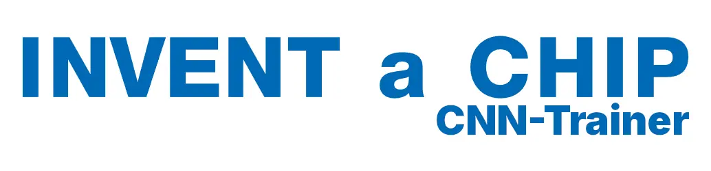

<p align="center">
    
</p>

<h1 align="center">IaC CNN-Trainer</h1>

Dies ist ein Hilfsprogramm mit grafischer Benutzeroberfläche, das ich im Rahmen von INVENT a CHIP 2025 erstellt habe.
Es kümmert sich um das Training und die Organisation von Audio-Classification-CNNs.

> [!IMPORTANT]
> Ich habe **keine offizielle Verbindung zu INVENT a CHIP** und diese Software wird weder von INVENT a CHIP noch von einer anderen offiziellen Stelle unterstützt und bereitgestellt. Es handelt sich um ein unabhängiges Projekt einer Privatperson.

> [!IMPORTANT]
> Diese App wurde NICHT gevibecoded. Sollte es Probleme geben, versuche ich zu helfen - öffne einfach ein Issue - aber ich kann nichts versprechen.

## Was es kann

- das Training von CNNs anordnen, visualisieren, überwachen etc.
- die trainierten CNNs und deren Architekturen strukturiert speichern und organisieren
- Leistungsmessungen der CNNs durchführen
- Dateien für Cutecom mithilfe des uns gegebenen Skriptes erzeugen und organisiert abspeichern

Dabei ist alles hübsch aufbereitet. Ich habe großen Wert auf Codequalität gelegt. Bitte den Code der Oberfläche und des Programms im Generellen beachten.

## Installation

Bitte für die Installation des Programms folgenden Befehl ausführen:

```bash
./scripts/install.sh
```

Es handelt sich hier um eine Web-Oberfläche, die mittels Flask geschrieben wurde. Getestet in Python 3.10.
Die Installation wird sich selbst überprüfen. Um das selbst nachzuholen, sicherstellen, dass das venv `.venv-server` aktiviert ist, dann

```bash
./.venv-server/bin/python3 ./scripts/health_check.py
```

ausführen.

Das Skript wird Python 3.8 und Python 3.10 installieren, virtuelle Umgebungen erzeugen, alle Dependencies laden und dann das venv für 3.10 aktiviert lassen.

Um das GUI zu starten, bitte

```bash
./.venv-server/bin/python3 ./main.py
```

ausführen. Um aus `app/cnn.py` frei zu zitieren,

```
Der Workflow ist also wie uns schon bekannt, nur jetzt mit schönem UI:

+-----------------+     +-------------------+     +------------+
|  Architekturen  | --> |  trainierte CNNs  | --> |  Payloads  |
+-----------------+     +-------------------+     +------------+
```

> [!IMPORTANT]
> Aus urheberrechtlichen Gründen darf ich die Skripte `cnn_training.py`, `cnn_convert.py` und das Skript zur UART-Payloadgenerierung leider nicht einfach so bereitstellen.
> Sie werden aber für die Software benötigt. Du musst sie im Ordner `scripts/` ablegen und so umschreiben, dass sie die Kommandozeilenargumente korrekt verarbeiten, die vom IaC CNN-Trainer übergeben werden.

## Bewertungskriterien

Tipp: Accuracy ist leicht wichtiger als Geschwindigkeit.

Siehe Präsentation "12_projektmanagement.pdf".

| Disziplin       | prozentuale Bewertung |
|-----------------|-----------------------|
| Accuracy        | 57,1%                 |
| Geschwindigkeit | 42,9%                 |

# Zitieren

Bitte nenne diese Software in deinem Projektbericht, wenn Du sie verwenden solltest. Eine BibTeX-Zitierung habe ich dir vorbereitet.

```bibtex
@misc{schlinsog2025iac,
    author       = {Magnus Leonard Schlinsog},
    title        = {IaC CNN-Trainer},
    year         = {2025},
    howpublished = {\url{https://github.com/mags0ft/IaC-CNN-Trainer/}},
    note         = {Software available at GitHub}
}
```
